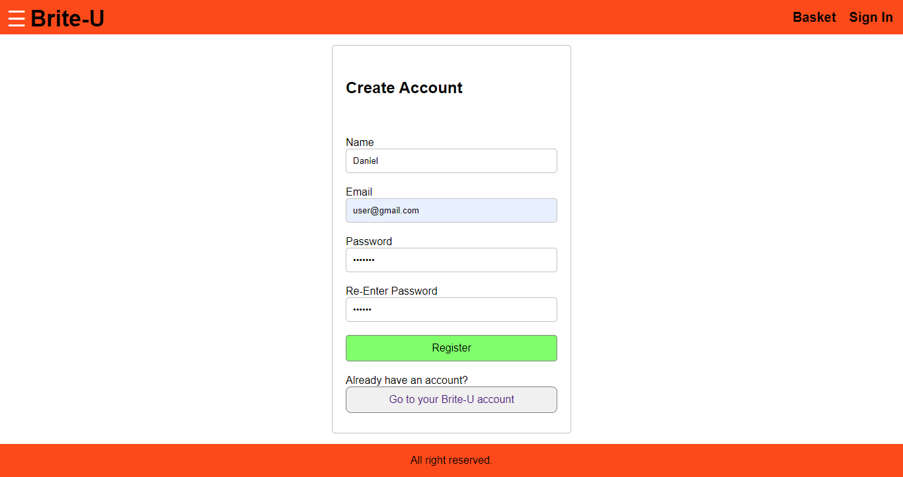

# brite-U-eCommerce-project


## Built With

### Front-end

* [React](https://reactjs.org/)
* [Redux](https://redux.js.org/)
* [CSS](https://en.wikipedia.org/wiki/Cascading_Style_Sheets)

### Back-end

* [Javascript](https://www.javascript.com/)
* [Nodejs](https://nodejs.org/en/)
* [Express](https://expressjs.com/)
* [MongoDB](https://www.mongodb.com/)


## What is Brite-U?

Brite-U is an eCommerce of products based on electric scooters and bicycles that favour individual transporting without damaging the environment.

* [Brite-U](https://brite-u.com/)

In this project I have created a new full website with features including users/log-in, basket, payment methods and order history.

## Getting Started

### Prerequisites

For this project you need:

```
Nodejs
```

### Installing

Go to brite-U-eCommerce-project/server and run:

```
npm install
```

Now you can run the server. You can use any port but remember that later we will run react in port 3000. For example, run:

```
PORT=5000 nodemon index.js
```

Now you can go to brite-U-eCommerce-project/client and install all the react dependencies:

```
npm install
```

## Running React

In the folder brite-U-eCommerce-project/client/src run:

```
npm start
```

Now you can see Brite-U web!


## Result

### Navigation

* Create account



* Sign In


* Basket


* Profile


### Payment

* Shipping


* Payment Methods


* Place Order


## Future Features

* Add new payment methods

* Pop-Up live chat

* New Style CSS


## Author

* **danisan9490**